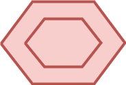
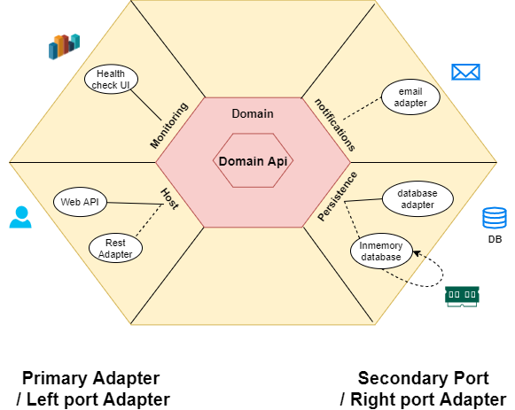
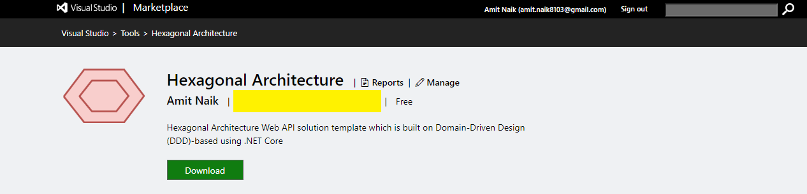
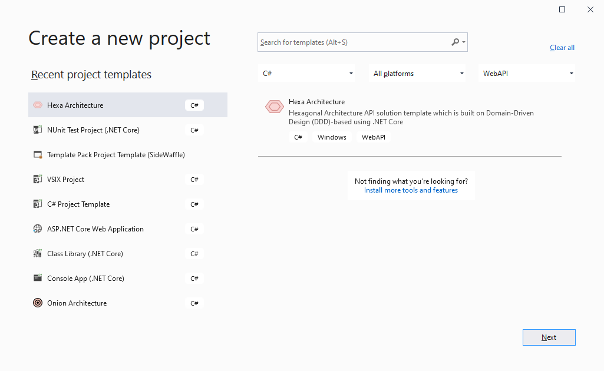
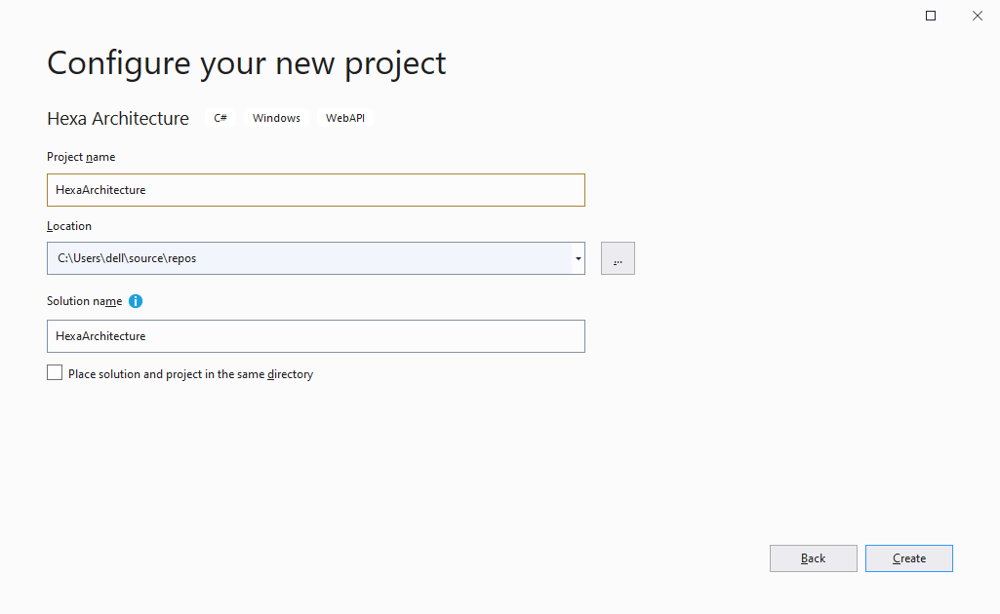
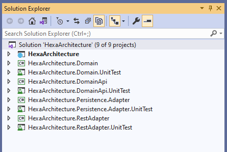
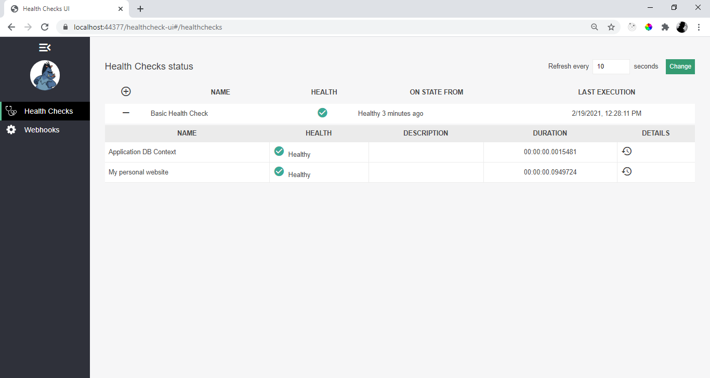
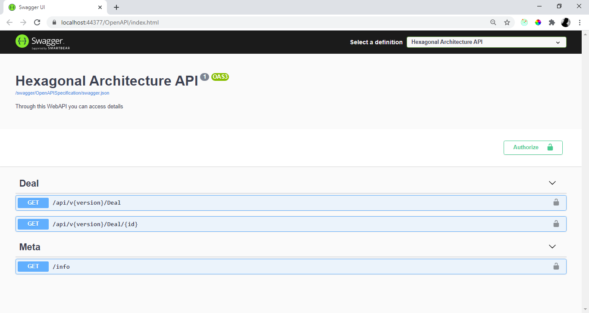

----

# Hexagonal Architecture ASP.NET Core

 

  

  <h3 align="center">Hexagonal Architecture ASP.NET Core</h3>

  

    App generator API solution template which is built on Hexagnonal Architecture with all essential feature using .NET Core!
     
    <a href="https://github.com/Amitpnk/Hexagonal-architecture-ASP.NET-Core"><strong>Explore the docs »</strong></a>
     
     
    <a href="https://github.com/Amitpnk/Hexagonal-architecture-ASP.NET-Core">View Demo</a>
    ·
    <a href="https://github.com/Amitpnk/Hexagonal-architecture-ASP.NET-Core/issues">Report Bug</a>
    ·
    <a href="https://github.com/Amitpnk/Hexagonal-architecture-ASP.NET-Core/issues">Request Feature</a>
  

  
Table of Contents

  <ol>
    <li>
      <a href="#about-the-project">About The Project</a>
      <ul>
        <li><a href="#built-with">Built With</a></li>
      </ul>
    </li>
    <li>
      <a href="#getting-started">Getting Started</a>
      <ul>
        <li><a href="#prerequisites">Prerequisites</a></li>
        <li><a href="#installation">Installation</a></li>
      </ul>
    </li>
    <li><a href="#usage">Usage</a></li>
    <li><a href="#roadmap">Roadmap</a></li>
    <li><a href="#contributing">Contributing</a></li>
    <li><a href="#license">License</a></li>
    <li><a href="#contact">Contact</a></li>
    <li><a href="#acknowledgements">Acknowledgements</a></li>
  </ol>

## Give a Star! :star:
If you like or are using this project to learn or start your solution, please give it a star. Thanks!

## Support This Project

If you have found this project helpful, either as a library that you use or as a learning tool, please consider buying me a coffee:

## Hexagonal Architecture

Hexagonal architecture was proposed by Alistair Cockburn in 2005.

Hexagonal Architecture, or to call it properly, "Ports and Adapters pattern", is driven by the idea that the application is central to your system. All inputs and outputs reach or leave the core of the application through a port that isolates the application from external technologies, tools and delivery mechanics

## About The Project

App generator API solution template which is built on Hexagnonal Architecture with all essential feature using .NET Core!

## Getting Started

### Step 1: Download extension from project template

   
 <a href="https://marketplace.visualstudio.com/items?itemName=AmitNaik.HexagonalArchitecture">Download from Marketplace</a>

### Step 2: Create Project

Select project type as WebAPI, and select Hexagonal Architecture

### Step 3: Select Hexagonal Architecture project template

Select project type as Web API, and select Hexagonal Architecture

### Step 4: Project is ready

### Step 5: Build and run application

#### Health check UI

Navigate to Health Checks UI https://localhost:44377/healthcheck-ui and make sure everything is green.

** Change port number according to your application

#### Swagger UI

Swagger UI https://localhost:44377/OpenAPI/index.html

** Change port number according to your application

## Contributing

Contributions are what make the open source community such an amazing place to be learn, inspire, and create. Any contributions you make are **greatly appreciated**.

1. Fork the Project
2. Create your Feature Branch (`git checkout -b feature/AmazingFeature`)
3. Commit your Changes (`git commit -m 'Add some AmazingFeature'`)  
Note: while commiting message follow [conventional standard](https://www.conventionalcommits.org/en/v1.0.0/)
4. Push to the Branch (`git push origin feature/AmazingFeature`)
5. Open a Pull Request

## Project description

we can see that all the Layers are dependent only on the Core Layers

  
<b>Domain Api layer</b>

  

    Domain Api Layers (Core layer) is implemented in center and never depends on any other layer.  
    It is contract for domain layer interaction(ports) so that primary and secondary adapters can implement the contract.This is also known and DIP or Dependency Inversion Principle
  

  
<b>Domain layer</b>

  

    Domain Layers (Business layer) which has business logic. and it is keep clean with no other dependencies.
  

  
<b>Rest Adapter layer</b>

  

    Rest Adapter also known as <i>left port's adapter</i> and <i>primary adapter</i> where we implement restfull service (i.e., GET, POST, PUT, DELETE, etc)
  

  
<b>Persistence Adapter layer</b>

  

    Rest Adapter also known as <i>right port's adapter</i> and <i>secondary adapter</i>where we have implement Entityframework core which already implements a repository design pattern. DbContext will be UoW (Unit of Work) and each DbSet is the repository. This interacts with our database using dataproviders
  

  
<b>Bootstrap/Presentation Layer</b>

  

    This is final build of project, where it all begins
  

## Licence Used

See the contents of the LICENSE file for details

## Contact

Having any issues or troubles getting started? Drop a mail to amit.naik8103@gmail.com or [Raise a Bug or Feature Request](https://github.com/Amitpnk/Hexagonal-architecture-ASP.NET-Core/issues/new). Always happy to help.

## Acknowledgements

* [Article 1 - Hexagonal Architecture](https://dzone.com/articles/hexagonal-architecture-what-is-it-and-how-does-it)
* [Article 2 - Difference between Hexa and Microservice](https://stackoverflow.com/questions/54697026/hexagonal-architecture-and-microservices-how-do-they-fit-together)
* [Article 3 - Microservices Hexagonal Architecture](https://medium.com/sciforce/another-story-about-microservices-hexagonal-architecture-23db93fa52a2)
* [Article 4 - Netflix - Hexagonal article](https://netflixtechblog.com/ready-for-changes-with-hexagonal-architecture-b315ec967749)